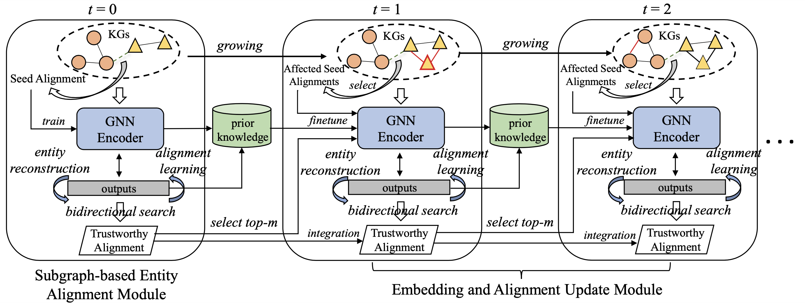

# ContEA: Continual Entity Alignment

This repository is the official implementation of ContEA, the method proposed in paper [***Facing Changes: Continual Entity Alignment for Growing Knowledge Graphs***](https://arxiv.org/abs/2207.11436) at ISWC2022.

> Entity alignment is a basic and vital technique in knowledge graph (KG) integration. 
Over the years, research on entity alignment has resided on the assumption that KGs are static, which neglects the nature of growth of real-world KGs.
As KGs grow, previous alignment results face the need to be revisited while new entity alignment waits to be discovered. 
In this paper, we propose and dive into a realistic yet unexplored setting, 
referred to as continual entity alignment.
To avoid retraining an entire model on the whole KGs whenever new entities and triples come,
we present a continual alignment method for this task.
It reconstructs an entity's representation based on entity adjacency, 
enabling it to generate embeddings for new entities quickly and inductively using their existing neighbors.
It selects and replays partial pre-aligned entity pairs to train only parts of KGs while extracting trustworthy alignment for knowledge augmentation.
As growing KGs inevitably contain non-matchable entities, different from previous works, 
the proposed method employs bidirectional nearest neighbor matching to find new entity alignment and update old alignment.
Furthermore, we also construct new datasets by simulating the growth of multilingual DBpedia.
Extensive experiments demonstrate that our continual alignment method is more effective than baselines based on retraining or inductive learning.



## Datasets

We construct three incremental cross-lingual ([ZH-EN](https://github.com/nju-websoft/ContEA/tree/main/datasets/ZH-EN), [JA-EN](https://github.com/nju-websoft/ContEA/tree/main/datasets/JA-EN), and [FR-EN](https://github.com/nju-websoft/ContEA/tree/main/datasets/FR-EN)) datasets for continual entity alignment task, in which the to-be-aligned KGs are growing independently over time. 

The datasets can be downloaded in folder `datasets/`. Each dataset contains 6 consecutive snapshots of two growing KGs. 

```python
 --- base/       # snapshot 0
 |- batch2/      # snapshot 1
 |- batch3/      # snapshot 2
 |- batch4/      # snapshot 3
 |- batch5/      # snapshot 4
 |- batch6/      # snapshot 5
 |- ent_dict     # index for entities
 |- rel_dict     # index for relations
```

The test and validation data are changeless in our continual entity alignment setting, and can be found in the first snapshot (under `base/` folder). In the later snapshots (under `batchX` folder), new triples are added into KGs as well as new potential alignment.

## Environment

The essential packages and recommened version to run the code:

- python3 (>=3.7)
- pytorch (1.11.0+cu113)
- numpy   (1.21.5)
- torch-scatter (2.0.9, see the following)
- scipy  (1.7.3)
- tabulate  (0.8.9)

You can install torch-scatter using this line:
```
$ pip install torch-scatter==2.0.9 -f https://data.pyg.org/whl/torch-1.12.0+cu102.html
```
Replace `https://data.pyg.org/whl/torch-1.12.0+cu102.html` with your configured torch version (check using `print(torch.__version__)`).

## Run ContEA

Download this project and firstly create two folders `logs/` and `saved_model/` in the same directory with `src/`.

```python
 - ContEA/     
     |- logs/   
     |- saved_model/    
     |- datasets/
     |- src/  
```

We provide a demo script in `src/run.sh` to run ContEA on ZH-EN dataset. The hyperparameters can reproduce the results in paper. To run the demo script, enter `src/` and run:

```
$ bash run.sh
```

### Hyperparameter Setting

In our work, we set 𝛼 = 0.1, 𝛽 = 0.1, 𝑚 = 500, 𝜆 = 2.0. Both entity and relation dimension are 100. GNN layer number of the encoder is 2. We use grid search on important hyperparameters to find optimal values. They are:

| Hyperparameter      | Values |
| :---        |    :----:   |  
| batch_size (t = 0)   | {512, 1024} |
| batch_size (t > 0) | 512 |
| learning_rate (t = 0) | {0.0005, 0.001, 0.01} |
| learning_rate (t > 0) | 0.001 |
| dropout_rate | 0.3 |

The training on the first snapshot at t = 0 is crucial for overall performance.

## Acknowledgment

ContEA is designed upon the static entity alignment model [Dual-AMN](https://github.com/MaoXinn/Dual-AMN) (implemented in tensorflow). We thank them for making the code open-sourced.

## Citation

```
@inproceedings{ContEA,
  title     = {Facing Changes: Continual Entity Alignment for Growing Knowledge Graphs},
  author    = {Wang, Yuxin and 
               Cui, Yuanning and 
               Liu, Wenqiang and 
               Sun, Zequn and 
               Jiang, Yiqiao and 
               Han, Kexin and 
               Hu, Wei},
  booktitle = {ISWC},
  year      = {2022}
}
```
